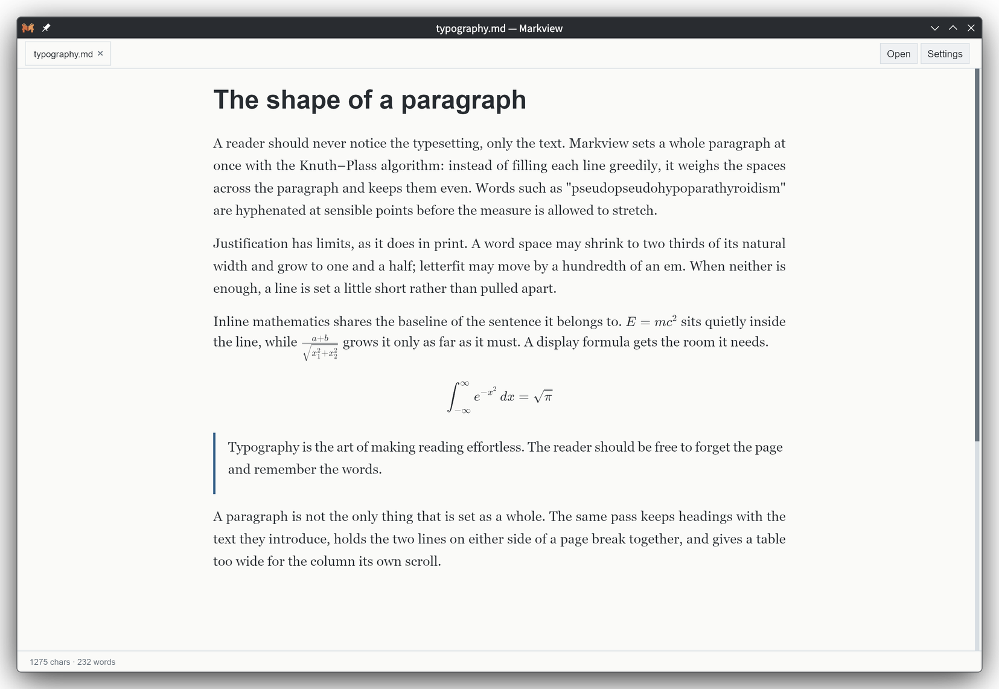
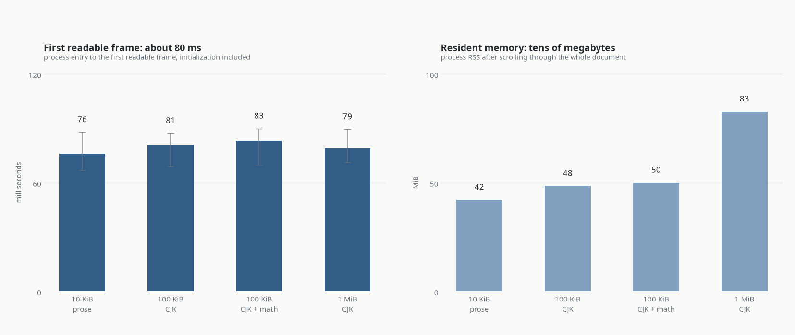
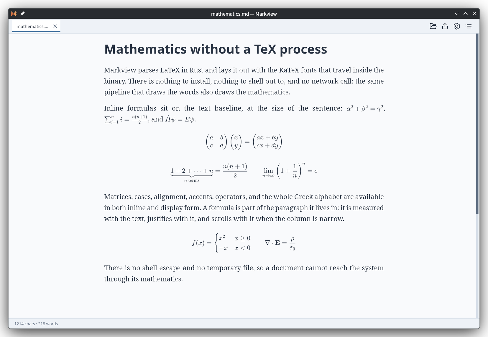
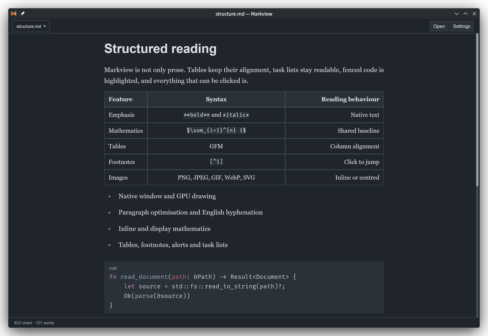

<p align="center">
  
</p>

<h1 align="center">Markview</h1>

<p align="center">
  <strong>A fast, native Markdown reader with publication-quality typography.</strong><br>
  Markdown, mathematics, code, tables and images, typeset straight to the screen —
  with no browser, no WebView, no JavaScript and no TeX process.
</p>

<p align="center">
  <a href="https://github.com/szdytom/markview/actions/workflows/ci.yml"></a>
  <a href="https://github.com/szdytom/markview/releases"></a>
  <a href="LICENSE"></a>
</p>

<p align="center">
  <a href="#install">Install</a> ·
  <a href="#how-it-compares">How it compares</a> ·
  <a href="#reading">Reading</a> ·
  <a href="#export">Export</a> ·
  <a href="#stylesheets">Stylesheets</a> ·
  <a href="#documentation">Documentation</a>
</p>

<p align="center">
  English · <a href="README.zh-cn.md">简体中文</a>
</p>

<p align="center">
  
</p>

## Install

Download the latest build from [Releases](https://github.com/szdytom/markview/releases):

| Platform | Packages |
|:--|:--|
| Linux | `.deb`, AppImage, `.tar.gz` |
| Windows | `.msi`, `.zip` |
| macOS | zipped `.app` bundle |

On Linux and macOS the install script does the same thing:

```sh
curl --proto '=https' --tlsv1.2 -LsSf \
  https://github.com/szdytom/markview/releases/latest/download/markview-installer.sh | sh
```

Linux builds need glibc 2.35 or newer, `libfontconfig1`, a working Vulkan
driver, and a desktop portal for file dialogs. The macOS bundle is unsigned, so
clear the quarantine flag once after downloading it:

```sh
xattr -d com.apple.quarantine /Applications/Markview.app
```

The Windows MSI adds Markview to the **Open with** list for `.md`, `.markdown`
and `.mdown` and lists it under **Default apps**. Windows 10 and 11 still ask the
user to confirm the handoff, so the first one of those files is a choice, not
something an installer can make on the user's behalf.

Per-platform details and the exact artifact list are in the
[packaging guide](docs/packaging.md).

## Why Markview

- **Fast at any size.** About 80 ms from launch to the first readable frame,
  whether the file is a 10 KiB note or a 1 MiB book. Layout runs on a worker
  thread and the page is published as it is built, so the window never waits for
  the whole document.
- **Print-grade typography.** Whole-paragraph Knuth–Plass line breaking, English
  hyphenation, and justification bounded by Typst's limits instead of stretched
  until the line comes apart. CJK text gets the same care, down to which
  punctuation may open or close a line.
- **Real mathematics.** Inline and display LaTeX, parsed in Rust and set with the
  KaTeX fonts that travel inside the binary. Nothing to install, nothing to shell
  out to, no network.
- **Small and native.** An 11–15 MB download that unpacks to one self-contained
  binary — no runtime, no Electron, no Node. A typical document reads in about
  42 MiB of resident memory.
- **A reader, not an editor.** Read-only by design. It watches the file, keeps
  your place, opens linked documents in tabs, and stays out of the way.

## Performance

The first readable frame does not wait for the whole document: Markview lays the
page out on a worker thread and publishes each complete prefix as it is ready.

<p align="center">
  
</p>

Every document, from a 10 KiB note to a 1 MiB book, reaches its first readable
frame in 76–83 ms, process start and initialization included. Each bar is the
median of fifteen native runs and the thin line is their range; the ranges
overlap completely, which is the point. Resident memory stays in the tens of
megabytes: about 42 MiB for a note, 50 MiB for 100 KiB of CJK with mathematics,
and 83 MiB for a megabyte of CJK.

These are one ordinary laptop's numbers, not a specification: an Intel Core
Ultra 5 125H with integrated Intel Arc through Vulkan, on the `performance`
power profile. The CPU, the GPU, the driver, the fonts, the display scale, the
system load and the power profile all move them — the project's own notes record
the same host at roughly twice the first-frame time under `power-saver`. The
[performance model](docs/performance.md) has the method, the full baselines, and
what each number does and does not cover.

## How it compares

<p align="center">
  
</p>

Opening a file, median of three runs in seconds, window included:

| Document | Markview | SuperGoodViewer | MarkText |
|:--|--:|--:|--:|
| 10 KiB of prose | 0.12 | 0.61 | 1.13 |
| 100 KiB of prose | 0.12 | 0.94 | 1.12 |
| 10 KiB, 108 display formulas | 0.12 | failed to render¹ | 1.39 |
| 100 KiB, 1092 display formulas | 0.11 | failed to render¹ | 3.24 |

Resident memory once the document is on screen, in MiB, every process of each
reader counted:

| Document | Markview | SuperGoodViewer | MarkText |
|:--|--:|--:|--:|
| 10 KiB of prose | 46 | 296 | 696 |
| 100 KiB of prose | 46 | 347 | 706 |
| 10 KiB, 108 display formulas | 48 | — | 753 |
| 100 KiB, 1092 display formulas | 50 | — | 1143 |

¹ SuperGoodViewer's LaTeX path rejects the matrix in this fixture
(`unknown variable: pmatrix`) and its window stays on a compile-error notice, so
it is recorded rather than timed.

One document to one PDF, median of three runs in seconds:

| Engine | 10 KiB | 100 KiB |
|:--|--:|--:|
| `markview --pdf` | 0.04 | 0.10 |
| `pandoc --pdf-engine=typst` | 0.48 | 0.72 |
| `pandoc` → headless Chromium | 0.65 | 0.83 |
| `pandoc --pdf-engine=xelatex` | 1.89 | 2.16 |

One machine, one day. Method and caveats: [comparison page](docs/comparison.md).

## Mathematics

Inline and display LaTeX is parsed in Rust and measured with the paragraph it
lives in: a formula shares the text baseline, justifies with the words around
it, and scrolls sideways when the column is narrow. Matrices, cases, alignment,
accents, operators and the whole Greek alphabet work in either position.

<p align="center">
  
</p>

## More than prose

Tables keep their alignment, fenced code is highlighted, footnotes are numbered
and clickable, GitHub alerts keep their meaning, and images — PNG, JPEG, GIF,
WebP, BMP, ICO or SVG, with an animated image showing its first frame — sit
inline or centred. A `mermaid` fenced block becomes a diagram: flowcharts,
sequence diagrams and the other supported types are laid out and rasterized in
Rust, so they need no browser, network or external process. Links to other
Markdown files open in new tabs, so a folder of documents behaves like one.
Everything can be selected and copied, and any block too wide for the column
scrolls on its own.

Network images (`http:` and `https:`) are cached on disk between runs. A body
the server marks cacheable is reused until it goes stale, then revalidated with
a conditional request rather than downloaded again; `--offline` serves a cached
body without touching the network. The cache lives beside `settings.toml` (on
Linux, `~/.config/markview/cache/images`), holds at most 128 MiB with the least
recently used entries dropped first, and is cleared by deleting that directory.

<p align="center">
  
</p>

## Reading

| Keys | Action |
|:--|:--|
| `Ctrl+O` | Open a file |
| `Ctrl+T` | Choose a stylesheet |
| `Ctrl+E` | Export the document |
| `Ctrl+,` | Open settings |
| `Ctrl++` / `Ctrl+-` | Larger or smaller type |
| `Ctrl+[` / `Ctrl+]` | Narrower or wider reading column |
| `Ctrl+V` | Read Markdown from the clipboard in a new tab |
| `Ctrl+W` | Close the tab |
| `Ctrl+A` / `Ctrl+C` | Select the document, or copy the selection |
| Wheel, arrows, `Page Up`/`Page Down`, `Space`, `Home`/`End` | Scroll |

macOS uses Command in place of Ctrl. The reading column defaults to 760 logical
pixels and the type to 18.

- **Opening is flexible.** Launch with no file for an empty window, drop a
  Markdown file onto it, or paste Markdown from the clipboard; the file is read
  as UTF-8, a BOM included.
- **Tabs behave.** Drag a tab to reorder it, close one with its × button or the
  middle mouse button, and scroll an overflowing strip with the wheel.
- **Links open where they should.** Web, mail and local files go to the
  operating system's default handler; links to other `.md` files open in a new
  tab, and middle-click opens them in the background. A `#heading` fragment
  moves to that heading, in this document or in the file it names.
- **The file is watched.** Edit it in your own editor and Markview repaints in
  place, keeping your position unless you were already at the end.
- **Justification has limits.** A word space may shrink to two thirds or grow to
  one and a half of its own width, and letterfit may move by a hundredth of an
  em. Change them under `[justification]` in `settings.toml`, or set both
  tracking bounds to `0.0` to turn character-level justification off. Hyphenation
  is on by default.
- **Paragraph indent is off by default.** Choose it under **Settings**, or set
  `paragraph_indent` in `settings.toml`: prose indents its opening line while
  lists indent as a whole, and table cells and footnotes stay flush.
- **CJK is first-class.** The `cjk-type` setting (`SC`, `TC`, `JP` or `none`)
  picks the face and the punctuation convention together: a comma-like mark
  gives back its blank half at a line end on the mainland and in Japan, and is
  centred in Taiwan.
- **A hard break stays hard.** Two trailing spaces leave the line at its natural
  width; an explicit `<br>` asks for the line it ends to be set flush.

Markview is deliberately read-only: it does not edit or save Markdown, and it has
no table of contents, search, or multi-document workspace beyond the tabs opened
from Markdown links. Printing means the export panel or `--pdf`, not a system
print dialog. Links
address headings by their GitHub slug; raw HTML `id` attributes are not
interpreted, so an explicit anchor is not a link target.

## Export

Markview exports without a browser or a print dialog. In the reader, `Ctrl+E` or
the toolbar's export button opens an export panel: it writes the document to
PDF, or to one PNG of the whole document, and opens the result with the
operating system. **Export and Watch…**, beside it, keeps rewriting the same
file whenever the document is saved. The panel carries its own text size
(12 pt by default), first-line
indent, paper, orientation, margins, PNG scale and stylesheet sequence — the
bundled `print` sheet is layered with whatever the panel selects — all kept
under `[export]` in `settings.toml`. Changing them never reflows the reading
view.

The same exports are on the command line, for scripts and batch runs:

```sh
markview --pdf document.md --output document.pdf
markview --pdf document.md -o paper.pdf --paper letter --margin 20,25
markview --pdf document.md -o paper.pdf --footer "{title} — {page}/{pages}"
markview --pdf document.md -o document.pdf --watch
```

The bundled `print` stylesheet supplies the paper: A4 with 20 mm side margins,
black on white, and a centred page number. Body text is 12 pt unless
`--font-size` says otherwise. `--paper` takes `a3`, `a4`, `a5`, `a6`, `b5`,
`letter`, `legal`, `tabloid`, or `WIDTHxHEIGHT` in millimetres; `--margin` takes
one, two, or four millimetres; `--landscape` swaps the sides.
The six header and footer slots are set with `--header`, `--footer` and the
`-left`/`-right` variants, and their templates may use `{page}`, `{pages}`,
`{title}` and `{path}`.

`--watch` keeps the command running after the first export and rebuilds the PDF
whenever the document, or a local image it references, changes; Ctrl+C ends the
session. Every rebuild reuses the unchanged parse, block layout and decoded
images, so an unchanged save is skipped and a small edit pays only for the part
that changed.

A paragraph keeps two lines on each side of a page break, a heading travels with
the block it introduces, code blocks wrap, and a table too wide for the page is
scaled down with a warning on stderr. Web and mail links become clickable
annotations, and a `#heading` link becomes an internal jump.

The PDF information dictionary takes `--title`, `--author` (repeat it for
several authors), `--subject`, `--keywords`, `--language` and `--creator`.
Nothing else is invented, and no creation or modification date is ever written,
which is what keeps two exports of one document byte for byte identical.

## Stylesheets

Use the built-in light and dark styles, or install a `.mvss.toml` stylesheet of
your own:

```sh
markview ss validate paper.mvss.toml
markview ss install paper.mvss.toml
markview document.md --style paper
```

The [stylesheet guide](docs/stylesheets.md) explains the format and the
conditions a rule may test.

## Documentation

| Page | What is in it |
|:--|:--|
| [Documentation map](docs/README.md) | Where every page lives, and why |
| [Stylesheet guide](docs/stylesheets.md) | Writing and installing MVSS themes |
| [Packaging guide](docs/packaging.md) | Release assets and per-platform requirements |
| [Performance model](docs/performance.md) | How the numbers above are measured |
| [Comparison](docs/comparison.md) | How the typography figure above is made |
| [Architecture](docs/architecture.md) | The boundaries the implementation preserves |
| [Security and threat model](docs/security.md) | What an untrusted document can reach |
| [Development guide](docs/development.md) | Building, testing and changing behavior |

## Development

The project is a Rust workspace. Start with the
[development guide](docs/development.md); the
[architecture](docs/architecture.md) explains the boundaries that changes should
preserve.

```sh
cargo run --release -- examples/welcome.md
```

Markview is MIT-licensed. Third-party notices are in
[THIRD_PARTY.md](THIRD_PARTY.md).
