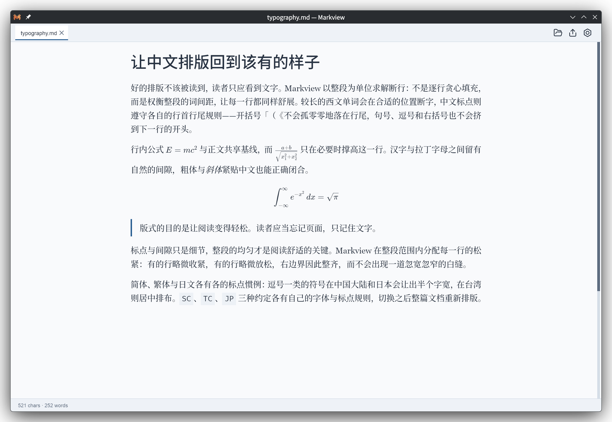
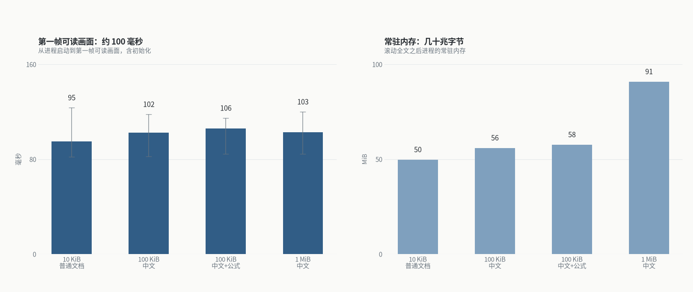
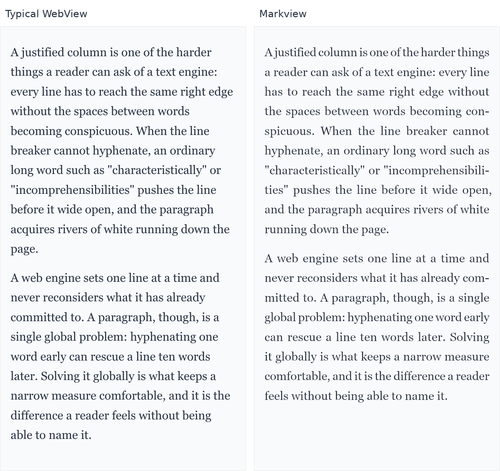
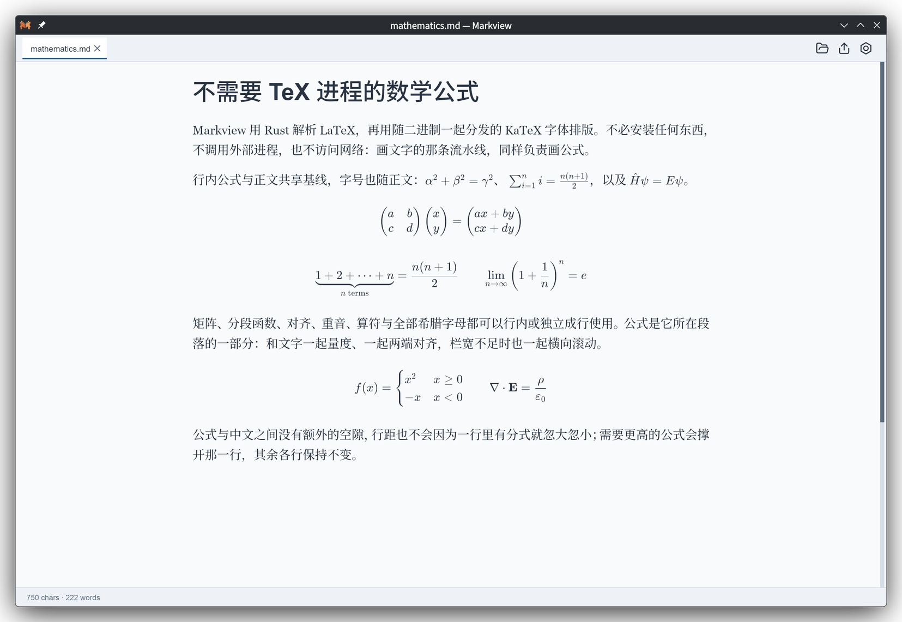
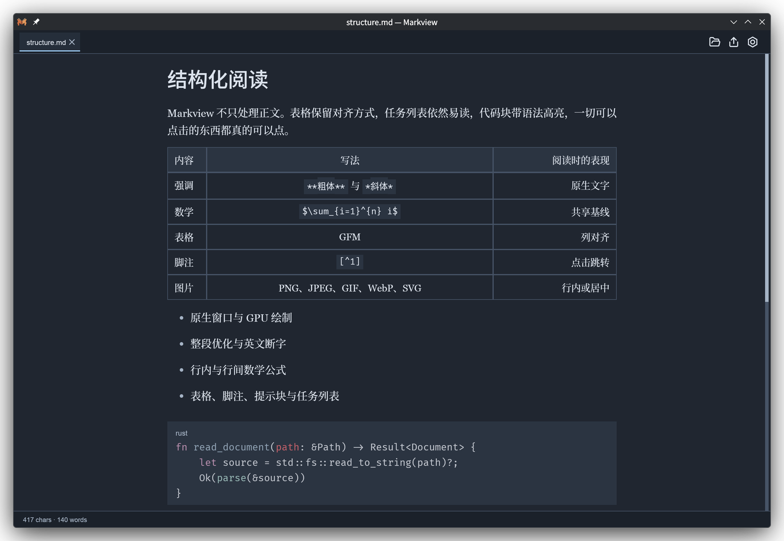

<p align="center">
  
</p>

<h1 align="center">Markview</h1>

<p align="center">
  <strong>快速、原生的 Markdown 阅读器，排版质量达到出版级。</strong><br>
  Markdown、数学公式、代码、表格与图片直接排版到屏幕——<br>
  不依赖浏览器、WebView、JavaScript 或 TeX 进程。
</p>

<p align="center">
  <a href="https://github.com/szdytom/markview/actions/workflows/ci.yml"></a>
  <a href="https://github.com/szdytom/markview/releases"></a>
  <a href="LICENSE"></a>
</p>

<p align="center">
  <a href="#安装">安装</a> ·
  <a href="#对比">对比</a> ·
  <a href="#阅读操作">阅读操作</a> ·
  <a href="#导出">导出</a> ·
  <a href="#样式表">样式表</a> ·
  <a href="#文档导航">文档导航</a>
</p>

<p align="center">
  <a href="README.md">English</a> · 简体中文
</p>

<p align="center">
  
</p>

## 安装

从 [Releases](https://github.com/szdytom/markview/releases) 下载最新版本：

| 平台 | 安装包 |
|:--|:--|
| Linux | `.deb`、AppImage、`.tar.gz` |
| Windows | `.msi`、`.zip` |
| macOS | 打包好的 `.app`（zip） |

Linux 与 macOS 也可以用安装脚本：

```sh
curl --proto '=https' --tlsv1.2 -LsSf \
  https://github.com/szdytom/markview/releases/latest/download/markview-installer.sh | sh
```

Linux 版本需要 glibc 2.35 或更新、`libfontconfig1`、可用的 Vulkan 驱动，以及用于文件对话框的桌面 portal。macOS 的 `.app` 未签名，下载后需要清除一次隔离标记：

```sh
xattr -d com.apple.quarantine /Applications/Markview.app
```

Windows 的 MSI 会把 Markview 加入 `.md`、`.markdown`、`.mdown` 的**打开方式**列表，并列入**默认应用**。Windows 10 和 11 仍会让用户确认一次，因此这些文件第一次由谁打开是用户的选择，安装程序无法代为决定。

各平台的具体要求与完整产物列表见[打包说明](docs/packaging.md)。

## 为什么选择 Markview

- **多大都很快。** 从启动到第一帧可读画面约 80 毫秒，10 KiB 的笔记和 1 MiB 的长文一样。排版在工作线程上进行，页面边排边发布，窗口从不必等整篇文档。
- **出版级的排版。** 以整段为单位求解断行（Knuth–Plass），支持英文断字；两端对齐的伸缩有明确上限，而不是把一行硬拽开。中文同样被认真对待，细到哪个标点可以出现在行首或行尾。
- **真正的数学公式。** 行内与行间 LaTeX 由 Rust 解析，用随二进制分发的 KaTeX 字体排版。不必安装任何东西，不调用外部进程，也不访问网络。
- **小巧且原生。** 11–15 MB 的下载包，解开就是一个自包含的可执行文件：没有运行时、没有 Electron、没有 Node。阅读一篇普通文档约占 42 MiB 常驻内存。
- **只读，因此专注。** Markview 不编辑、不保存。它监视文件、记住你的位置、把链接指向的文档开成新标签页，其余时候保持安静。

## 性能

第一帧可读画面不必等待整篇文档：Markview 在工作线程上排版，页面准备好一段就发布一段。

<p align="center">
  
</p>

从 10 KiB 的笔记到 1 MiB 的长文，第一帧可读画面都在 76–83 毫秒之间，其中已经包含进程启动与初始化。每根柱子是十五次原生运行的中位数，细线是实测范围——范围完全重叠，这正是重点。常驻内存保持在几十兆字节：普通笔记约 42 MiB，100 KiB 中文加公式约 50 MiB，1 MiB 中文约 83 MiB。

这些数字来自一台普通笔记本，而不是规格承诺：Intel Core Ultra 5 125H、核显 Intel Arc、走 Vulkan、电源模式为 `performance`。CPU、显卡、驱动、字体、显示缩放、系统负载与电源模式都会改变结果——项目记录里同一台机器在 `power-saver` 模式下第一帧耗时大约是这里的两倍。[性能模型](docs/performance.md)记录了测量方法、完整基线，以及每个数字覆盖与不覆盖的范围。

## 对比

<p align="center">
  
</p>

按各自方式打开同一个文件，三次运行中位数，单位秒，含窗口创建：

| 文档 | Markview | MarkText |
|:--|--:|--:|
| 10 KiB 正文 | 0.09 | 0.97 |
| 100 KiB 正文 | 0.10 | 0.99 |
| 10 KiB，108 个行间公式 | 0.11 | 1.24 |
| 100 KiB，1092 个行间公式 | 0.09 | 2.94 |

同一份文档导出一个 PDF，三次运行中位数，单位秒：

| 引擎 | 10 KiB | 100 KiB |
|:--|--:|--:|
| `markview --pdf` | 0.04 | 0.10 |
| `pandoc --pdf-engine=typst` | 0.48 | 0.72 |
| `pandoc` → 无头 Chromium | 0.65 | 0.83 |
| `pandoc --pdf-engine=xelatex` | 1.89 | 2.16 |

一台机器、一天的结果。方法与注意事项见[对比页面](docs/comparison.md)。

## 数学公式

行内与行间 LaTeX 由 Rust 解析，并与所在段落一起量度：公式与正文共享基线，和文字一起两端对齐，栏宽不足时一起横向滚动。矩阵、分段函数、对齐、重音、算符与全部希腊字母在两种位置都能使用。

<p align="center">
  
</p>

## 不止正文

表格保留对齐方式，代码块带语法高亮，脚注有编号且可以点击跳转，GitHub 提示块保留原有语义；图片（PNG、JPEG、GIF、WebP、BMP、ICO、SVG，动图只显示第一帧）可以行内排布或居中。指向其他 Markdown 文件的链接会在新标签页中打开，一个目录的文档因此像一份文档。所有内容都能选中和复制，过宽的块可以单独横向滚动。

<p align="center">
  
</p>

## 阅读操作

| 按键 | 操作 |
|:--|:--|
| `Ctrl+O` | 打开文件 |
| `Ctrl+T` | 选择样式表 |
| `Ctrl+E` | 导出文档 |
| `Ctrl+,` | 打开设置 |
| `Ctrl++` / `Ctrl+-` | 放大 / 缩小字号 |
| `Ctrl+[` / `Ctrl+]` | 收窄 / 加宽阅读栏 |
| `Ctrl+V` | 把剪贴板里的 Markdown 读进新标签页 |
| `Ctrl+W` | 关闭标签页 |
| `Ctrl+A` / `Ctrl+C` | 全选 / 复制选中内容 |
| 滚轮、方向键、`Page Up`/`Page Down`、`Space`、`Home`/`End` | 滚动 |

macOS 使用 Command 代替 Ctrl。默认阅读栏宽度为 760 逻辑像素，默认字号为 18。

- **打开方式很灵活。** 不指定文件会打开空窗口，也可以把 Markdown 文件拖进窗口，或直接粘贴剪贴板里的 Markdown；文件按 UTF-8 读取，包含 BOM 的文件同样可以。
- **标签页有应有的行为。** 拖动标签页可以重新排序，用×按钮或鼠标中键关闭；标签页过多时用滚轮横向滚动。
- **链接会在该去的地方打开。** `http`、`https`、`mailto` 与本地文件交给系统默认程序；指向其他 `.md` 文件的链接在新标签页中打开，中键则在后台打开。链接中的 `#标题锚点` 会定位到对应标题，无论它在当前文档还是刚打开的 `.md` 文件中。
- **文件会被监视。** 在自己的编辑器里修改即可，Markview 原地重绘；除非你已经滚到底部，否则阅读位置保持不变。
- **两端对齐有上限。** 词间空隙最少收缩到自身宽度的三分之二，最多伸展到一倍半；字距的调整不超过百分之一 em。可在 `settings.toml` 的 `[justification]` 中修改，把两个 tracking 边界都设为 `0.0` 即可关闭字级对齐。断字默认开启。
- **段落缩进默认关闭。** 可在**设置**中选择，或设置 `settings.toml` 中的 `paragraph_indent`：正文段落缩进首行，列表整体缩进，表格单元格和脚注不缩进。
- **中文排版是一等公民。** `cjk-type`（`SC`、`TC`、`JP` 或 `none`）同时决定字体与标点惯例：逗号一类的符号在中国大陆和日本会让出半个字宽，在台湾则居中排布。
- **硬换行就是硬换行。** 行尾两个空格让该行保持自然宽度；显式写 `<br>` 则要求这一行
  同样两端对齐。

Markview 有意保持只读：不能编辑或保存 Markdown，也没有目录、搜索，或超出 Markdown 链接所开标签页之外的多文档工作区；打印指的是导出面板或 `--pdf`，而不是系统打印对话框。标题锚点使用 GitHub 的 slug 规则；原始 HTML 的 `id` 属性不会被解析，因此不能作为链接目标。

## 导出

Markview 不需要浏览器或打印对话框就能导出文档。在阅读器里按 `Ctrl+E` 或点工具栏的导出按钮会打开导出面板：可写出 PDF 或整篇文档的一张 PNG，写好后交给系统打开；旁边的“Export and Watch…” 则会在文档每次保存时重新导出到同一个文件。面板有自己的字号（默认 12pt）、首行缩进、纸张、方向、页边距、PNG 倍率与样式表序列——以内置 `print` 为底，再叠加面板里选中的样式表——全部保存在 `settings.toml` 的 `[export]` 段里，改动它们不会让阅读视图重排。

同样的导出也有命令行形式，适合脚本与批处理：

```sh
markview --pdf document.md --output document.pdf
markview --pdf document.md -o paper.pdf --paper letter --margin 20,25
markview --pdf document.md -o paper.pdf --footer "{title} — {page}/{pages}"
markview --pdf document.md -o document.pdf --watch
```

内置的 `print` 样式表决定纸张：A4、左右 20mm 页边距、白底黑字、页脚居中页码。正文默认 12pt，除非用 `--font-size` 另行指定。`--paper` 接受 `a3`、`a4`、`a5`、`a6`、`b5`、`letter`、`legal`、`tabloid` 或毫米制的`宽x高`；`--margin` 接受 1、2 或 4 个毫米值；`--landscape` 交换长短边。页眉页脚共六个槽位，用 `--header`、`--footer` 及 `-left`/`-right` 变体设置，模板中可用 `{page}`、`{pages}`、`{title}`、`{path}`。

`--watch` 让命令在首次导出后继续运行：文档或其引用的本地图片一有变化就重建 PDF，按 Ctrl+C 结束。每次重建都复用未变的解析、块排版与已解码图片，因此内容没变的保存会被跳过，小改动只需为改动部分付出代价。

跨页时每段两边各留两行，标题与随后的内容一起移动，代码块自动换行，过宽的表格会缩小并在 stderr 给出警告。网页和邮件链接变成可点击注释，`#标题` 链接变成文档内跳转。

PDF 信息字典可用 `--title`、`--author`（可重复以写多位作者）、`--subject`、`--keywords`、`--language`、`--creator` 指定。除此之外不会凭空写入任何字段，也从不写入创建或修改时间，因此同一文档每次导出的字节完全一致。

## 样式表

使用内置的亮色与暗色样式，或安装自己的 `.mvss.toml` 样式表：

```sh
markview ss validate paper.mvss.toml
markview ss install paper.mvss.toml
markview document.md --style paper
```

格式与规则可用的语义条件见[样式表指南](docs/stylesheets.md)。

## 文档导航

| 页面 | 内容 |
|:--|:--|
| [文档地图](docs/README.md) | 每个页面放在哪里，以及为什么 |
| [样式表指南](docs/stylesheets.md) | 编写与安装 MVSS 主题 |
| [打包说明](docs/packaging.md) | 发布产物与各平台运行要求 |
| [性能模型](docs/performance.md) | 上文数字是如何测出来的 |
| [对比](docs/comparison.md) | 上文那张排版对比图是如何生成的 |
| [架构说明](docs/architecture.md) | 修改代码时应保持的边界 |
| [安全与威胁模型](docs/security.md) | 不可信文档能够触及的范围 |
| [开发指南](docs/development.md) | 构建、测试与修改行为 |

## 开发

项目是 Rust workspace。请从[开发指南](docs/development.md)开始；[架构说明](docs/architecture.md)解释了修改代码时应保持的边界。

```sh
cargo run --release -- examples/welcome.md
```

Markview 使用 MIT 许可证；第三方声明见 [THIRD_PARTY.md](THIRD_PARTY.md)。
