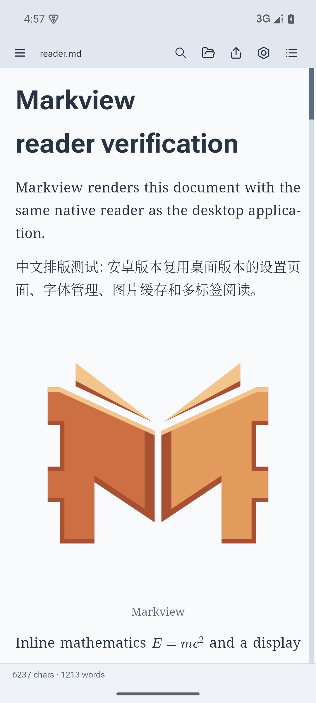
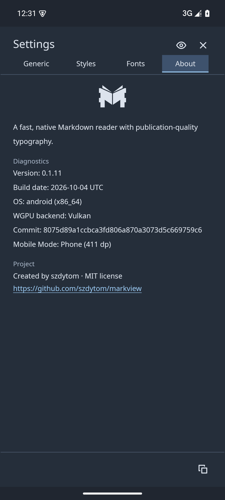
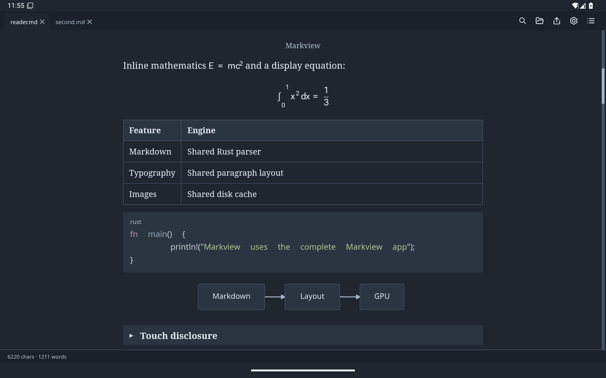
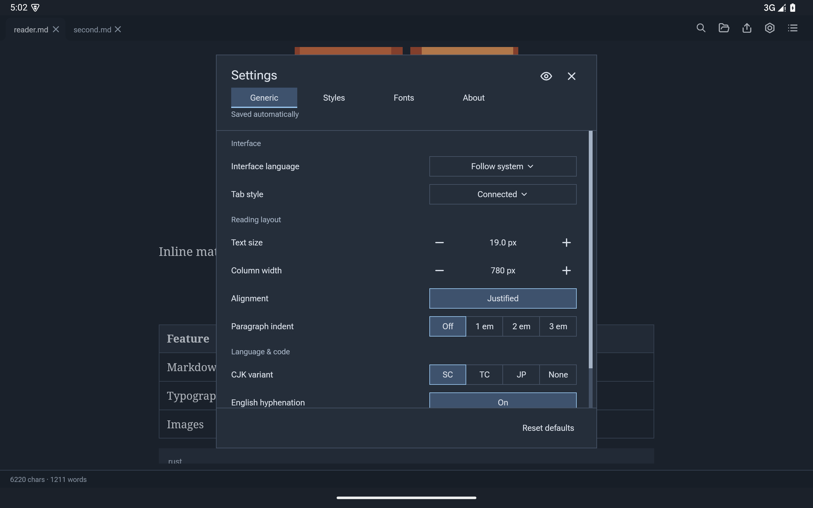

# MV4A

**MV4A — MarkView as a Android App** runs Markview's desktop application on
Android 9 (API 28) and newer. It uses the existing Rust `App`, native typography
and GPU renderer. Android supplies the activity, system file pickers, clipboard
and URI permissions.

The installed app is named **Markview**. **MV4A** is used only in documentation
to distinguish this Android subproject from the Markview desktop app and MVaaC.

## Screenshots

Captured from API 35 Pixel 6 and Pixel Tablet x86_64 emulators during the
integration suite. The screens reuse the desktop UI with phone adaptation.

| Reader | Fullscreen settings |
|---|---|
|  |  |
| Font manager | Dark styles |
|  |  |

Android layout diagnostics:



Phones manage tabs in the left drawer:


Tablets retain desktop tabs and support landscape:



Wide screens retain the centered settings dialog:



## What is shared

| Capability | Existing implementation used by MV4A |
|---|---|
| Settings, styles and languages | `src/app/chrome`, `src/settings.rs`, `src/stylesheet.rs` |
| Tabs and reading positions | `src/state`, `src/app/tab_strip.rs`, `src/app/tab_metrics.rs` |
| Font catalogue, downloads and family selection | `src/fonts.rs`, `src/app/font_panel`, shared font configuration |
| Images, SVG and Mermaid | `src/images`, including bounded decoding and the persistent HTTP cache |
| Markdown, CJK and mathematics | `markview-core`, the desktop worker and layout pipeline |
| Search, outline, gestures and image viewer | The desktop application controllers |
| PDF and PNG export | `src/app/export.rs`, `markview-pdf`, the desktop renderer |

The APK contains the root `markview` crate as `libmarkview.so`. The Android
entry point is `src/app/android.rs`; OS calls live in `src/platform/android.rs`
and `android/java`. The [pinned `winit` fork](https://github.com/szdytom/winit/commit/9299a76998fd8975afb97c5a1d81495845ab8ec8)
handles Activity destruction and allows event-loop recreation. This shares the
application above `core`, including its state and UI. Below 640 logical pixels,
settings occupy the entire app content area; wider screens retain the centered dialog. Narrow forms stack labels above
controls. Android's `values-sw600dp` resource qualifier selects tablet mode:

| Device configuration | Tab management | Orientation | Tab-style setting |
|---|---|---|---|
| Smallest width below 600 dp | Left drawer: switch, close and open documents | Portrait | Hidden and ignored |
| Smallest width at least 600 dp | Shared desktop tab strip | Portrait or landscape | Available |

Phone mode fills the available reading width with 20 logical pixels of margin
on each side and hides the column-width setting; tablets retain adjustable
columns. Scroll speed is hidden on all Android devices because it does not
change touch scrolling.

**About** and **Copy diagnostics** include one mobile-mode line, such as
`Mobile Mode: Phone (411 dp)` or `Mobile Mode: Tablet (800 dp)`.

The device mode follows the smallest width, independent of rotation and keyboard
visibility; configuration changes update it without discarding reader sessions. Desktop window-layout and single-instance settings are hidden and
ignored on Android; Android reuses the `singleTask` activity. System bars and
the keyboard are excluded from the reader's content area.

Upstream tracking: [Destroy handling #4303](https://github.com/rust-windowing/winit/issues/4303),
[event-loop recreation #3325](https://github.com/rust-windowing/winit/issues/3325),
and [Destroy fix #4711](https://github.com/rust-windowing/winit/pull/4711).
Return to a published upstream release once it includes both lifecycle fixes
and passes the phone and tablet Activity integration tests.

## Build and install

Use a recent Rust toolchain, Python 3, JDK 17 or newer, and the Android SDK.
The current script supports Linux and macOS build hosts. Install SDK command
line tools, accept the SDK licences, then install:

```sh
sdkmanager 'platform-tools' 'platforms;android-35' 'build-tools;35.0.0' 'ndk;29.0.14206865'
rustup target add aarch64-linux-android x86_64-linux-android
export ANDROID_HOME=/path/to/android-sdk
python3 android/build.py
adb install -r target/android/markview-android-debug.apk
```

`ANDROID_NDK_HOME` overrides the NDK location. If `ANDROID_HOME` is absent, the
script uses `.tools/android-sdk` in the repository. `--abi arm64-v8a` and
`--abi x86_64` build one architecture; the default APK contains both. Native
libraries and APK entries are aligned for 16 KiB pages.

`--release` enables Rust optimizations, disables Android debugging and writes
`target/android/markview-android-release.apk`. Both build variants are signed with a local development key in `target/android`.
Distribution signing and store publication are separate steps. SDK files,
keys, native libraries and APKs are excluded from Git.

## Read and customize

Tap **Open** to choose a file or a folder. Folder imports preserve relative
images and Markdown links; `README.md` is preferred as the first document.
Android's **Open with** and **Share** also send documents into Markview, and shared
text opens as a Markdown document. Tabs, touch scrolling, outline, search,
settings and styles use the same controllers as the desktop reader. Phones open
the tab drawer with the top-left menu button or a right swipe across the reader.
Selecting a tab, tapping the outside scrim or pressing Back dismisses the tab
drawer. A left swipe opens right-side Contents on phones and tablets, including
while the tab drawer is open. Back closes
the open search or panel before returning the task to the background.

Settings, downloaded fonts, styles and image cache live under the private app
files directory in `markview/`. Android settings omit the desktop buttons for
opening `settings.toml`, the fonts folder and the styles folder. Downloaded
fonts use the existing catalogue and font-family selectors.
Export uses Android's system save dialog and passes the written result to an
installed viewer. Repeated watched exports update the selected destination.

Documents are imported copies. Reopen a file or folder to import external
changes. Reimporting a folder removes files deleted at the source and retains
the previous copy if importing fails. Tabs survive rotations and activity
suspension; Activity destruction or process termination
starts a new tab session, as with the desktop application. Folder imports copy
the chosen tree, so choose the document's own folder rather than a large
archive. Android limits access to sibling files when only one file is granted;
use folder import for local images and neighbouring Markdown files.

## Emulator verification

Create an API 35 x86_64 AVD and boot it with a working GPU backend:

```sh
sdkmanager 'emulator' 'system-images;android-35;google_apis;x86_64'
avdmanager create avd -n markview-api35 -k 'system-images;android-35;google_apis;x86_64' --device pixel_6
emulator -avd markview-api35 -gpu host -no-snapshot
python3 android/build.py --abi x86_64
python3 android/test.py --serial emulator-5554 --layout phone
```

For tablet verification, create an AVD with `--device pixel_tablet`, boot it on
a separate port, and run `python3 android/test.py --serial emulator-5556 --layout tablet`.
`--layout-only` checks resource selection, orientation policy and tab-style
visibility for boundary configurations such as `sw599dp` and `sw600dp`.

The test APK supplies external content URIs and exercises real touch and key
input in the rendered reader. It checks multilingual Markdown, mathematics,
Mermaid and image decoding, scrolling and cached tabs, shared settings, font
catalogue pages, theme selection, search input, phone portrait lock,
phone drawer operations, tablet rotation, background/resume, durable preferences,
the system picker, folder refresh and failed imports, read-only grants, PDF saving,
GPU PNG export, and repeated Activity destruction/recreation in the same process.
Use `--lifecycle-only` to run just the Activity checks, including Android
**Don't keep activities**. Both devices can run without an emulator window by
adding `-no-window` to the emulator command.
Reports and screenshots are written to `artifacts/android/phone/` and
`artifacts/android/tablet/` (or the corresponding `*-boundary/` directories).

By default the test seeds a valid image-cache fixture from the repository logo
so it remains repeatable without public Internet access. `--online` instead
clears that entry and fetches the image from GitHub. HTTP cache fetching,
validation and offline behaviour are also covered by the shared workspace
tests. Tests run against a debug APK; the inspection JNI entry point is absent
from release builds.

For this development environment, emulator 36.1.8 with `-gpu host` boots and
renders through the Vulkan backend. Emulator 37.2.12 failed before guest boot,
and 36.1.8's SwiftShader backend failed during shader creation. These host
emulator limitations do not change the APK's Vulkan/OpenGL fallback.

Run the desktop regression and GPU export checks with:

```sh
cargo test --workspace --locked
cargo test --lib a_whole_document_png_export_stitches_its_tiles -- --ignored
cargo clippy --workspace --all-targets --locked -- -D warnings
```
