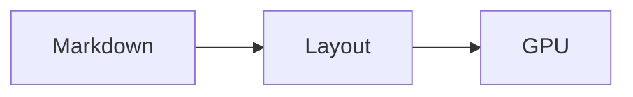

# Markview reader verification

Markview renders this document with the same native reader as the desktop application.

中文排版测试：安卓版本复用桌面版本的设置页面、字体管理、图片缓存和多标签阅读。


Inline mathematics $E = mc^2$ and a display equation:

$$
\int_0^1 x^2\,dx = \frac{1}{3}
$$

| Feature | Engine |
| --- | --- |
| Markdown | Shared Rust parser |
| Typography | Shared paragraph layout |
| Images | Shared disk cache |

```rust
fn main() {
    println!("Markview uses the complete Markview app");
}
```



<details><summary>Touch disclosure</summary>
Hidden content can be expanded by touching the summary.
</details>

## Scrolling and search

The search needle appears here. Swipe to move the document and switch back to this tab to retain the reading position.

## Last section

Paragraph 0. Native Android reading keeps the whole-paragraph typography of Markview. 字体、表格、公式、代码和图片都由共享引擎绘制。

Paragraph 1. Native Android reading keeps the whole-paragraph typography of Markview. 字体、表格、公式、代码和图片都由共享引擎绘制。

Paragraph 2. Native Android reading keeps the whole-paragraph typography of Markview. 字体、表格、公式、代码和图片都由共享引擎绘制。

Paragraph 3. Native Android reading keeps the whole-paragraph typography of Markview. 字体、表格、公式、代码和图片都由共享引擎绘制。

Paragraph 4. Native Android reading keeps the whole-paragraph typography of Markview. 字体、表格、公式、代码和图片都由共享引擎绘制。

Paragraph 5. Native Android reading keeps the whole-paragraph typography of Markview. 字体、表格、公式、代码和图片都由共享引擎绘制。

Paragraph 6. Native Android reading keeps the whole-paragraph typography of Markview. 字体、表格、公式、代码和图片都由共享引擎绘制。

Paragraph 7. Native Android reading keeps the whole-paragraph typography of Markview. 字体、表格、公式、代码和图片都由共享引擎绘制。

Paragraph 8. Native Android reading keeps the whole-paragraph typography of Markview. 字体、表格、公式、代码和图片都由共享引擎绘制。

Paragraph 9. Native Android reading keeps the whole-paragraph typography of Markview. 字体、表格、公式、代码和图片都由共享引擎绘制。

Paragraph 10. Native Android reading keeps the whole-paragraph typography of Markview. 字体、表格、公式、代码和图片都由共享引擎绘制。

Paragraph 11. Native Android reading keeps the whole-paragraph typography of Markview. 字体、表格、公式、代码和图片都由共享引擎绘制。

Paragraph 12. Native Android reading keeps the whole-paragraph typography of Markview. 字体、表格、公式、代码和图片都由共享引擎绘制。

Paragraph 13. Native Android reading keeps the whole-paragraph typography of Markview. 字体、表格、公式、代码和图片都由共享引擎绘制。

Paragraph 14. Native Android reading keeps the whole-paragraph typography of Markview. 字体、表格、公式、代码和图片都由共享引擎绘制。

Paragraph 15. Native Android reading keeps the whole-paragraph typography of Markview. 字体、表格、公式、代码和图片都由共享引擎绘制。

Paragraph 16. Native Android reading keeps the whole-paragraph typography of Markview. 字体、表格、公式、代码和图片都由共享引擎绘制。

Paragraph 17. Native Android reading keeps the whole-paragraph typography of Markview. 字体、表格、公式、代码和图片都由共享引擎绘制。

Paragraph 18. Native Android reading keeps the whole-paragraph typography of Markview. 字体、表格、公式、代码和图片都由共享引擎绘制。

Paragraph 19. Native Android reading keeps the whole-paragraph typography of Markview. 字体、表格、公式、代码和图片都由共享引擎绘制。

Paragraph 20. Native Android reading keeps the whole-paragraph typography of Markview. 字体、表格、公式、代码和图片都由共享引擎绘制。

Paragraph 21. Native Android reading keeps the whole-paragraph typography of Markview. 字体、表格、公式、代码和图片都由共享引擎绘制。

Paragraph 22. Native Android reading keeps the whole-paragraph typography of Markview. 字体、表格、公式、代码和图片都由共享引擎绘制。

Paragraph 23. Native Android reading keeps the whole-paragraph typography of Markview. 字体、表格、公式、代码和图片都由共享引擎绘制。

Paragraph 24. Native Android reading keeps the whole-paragraph typography of Markview. 字体、表格、公式、代码和图片都由共享引擎绘制。

Paragraph 25. Native Android reading keeps the whole-paragraph typography of Markview. 字体、表格、公式、代码和图片都由共享引擎绘制。

Paragraph 26. Native Android reading keeps the whole-paragraph typography of Markview. 字体、表格、公式、代码和图片都由共享引擎绘制。

Paragraph 27. Native Android reading keeps the whole-paragraph typography of Markview. 字体、表格、公式、代码和图片都由共享引擎绘制。

Paragraph 28. Native Android reading keeps the whole-paragraph typography of Markview. 字体、表格、公式、代码和图片都由共享引擎绘制。

Paragraph 29. Native Android reading keeps the whole-paragraph typography of Markview. 字体、表格、公式、代码和图片都由共享引擎绘制。

Paragraph 30. Native Android reading keeps the whole-paragraph typography of Markview. 字体、表格、公式、代码和图片都由共享引擎绘制。

Paragraph 31. Native Android reading keeps the whole-paragraph typography of Markview. 字体、表格、公式、代码和图片都由共享引擎绘制。

Paragraph 32. Native Android reading keeps the whole-paragraph typography of Markview. 字体、表格、公式、代码和图片都由共享引擎绘制。

Paragraph 33. Native Android reading keeps the whole-paragraph typography of Markview. 字体、表格、公式、代码和图片都由共享引擎绘制。

Paragraph 34. Native Android reading keeps the whole-paragraph typography of Markview. 字体、表格、公式、代码和图片都由共享引擎绘制。

Paragraph 35. Native Android reading keeps the whole-paragraph typography of Markview. 字体、表格、公式、代码和图片都由共享引擎绘制。

Paragraph 36. Native Android reading keeps the whole-paragraph typography of Markview. 字体、表格、公式、代码和图片都由共享引擎绘制。

Paragraph 37. Native Android reading keeps the whole-paragraph typography of Markview. 字体、表格、公式、代码和图片都由共享引擎绘制。

Paragraph 38. Native Android reading keeps the whole-paragraph typography of Markview. 字体、表格、公式、代码和图片都由共享引擎绘制。

Paragraph 39. Native Android reading keeps the whole-paragraph typography of Markview. 字体、表格、公式、代码和图片都由共享引擎绘制。

Paragraph 40. Native Android reading keeps the whole-paragraph typography of Markview. 字体、表格、公式、代码和图片都由共享引擎绘制。

Paragraph 41. Native Android reading keeps the whole-paragraph typography of Markview. 字体、表格、公式、代码和图片都由共享引擎绘制。

Paragraph 42. Native Android reading keeps the whole-paragraph typography of Markview. 字体、表格、公式、代码和图片都由共享引擎绘制。

Paragraph 43. Native Android reading keeps the whole-paragraph typography of Markview. 字体、表格、公式、代码和图片都由共享引擎绘制。

Paragraph 44. Native Android reading keeps the whole-paragraph typography of Markview. 字体、表格、公式、代码和图片都由共享引擎绘制。

Paragraph 45. Native Android reading keeps the whole-paragraph typography of Markview. 字体、表格、公式、代码和图片都由共享引擎绘制。

Paragraph 46. Native Android reading keeps the whole-paragraph typography of Markview. 字体、表格、公式、代码和图片都由共享引擎绘制。

Paragraph 47. Native Android reading keeps the whole-paragraph typography of Markview. 字体、表格、公式、代码和图片都由共享引擎绘制。

Paragraph 48. Native Android reading keeps the whole-paragraph typography of Markview. 字体、表格、公式、代码和图片都由共享引擎绘制。

Paragraph 49. Native Android reading keeps the whole-paragraph typography of Markview. 字体、表格、公式、代码和图片都由共享引擎绘制。