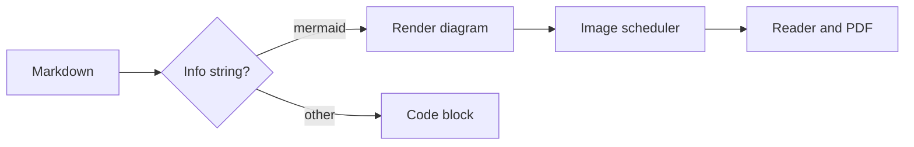
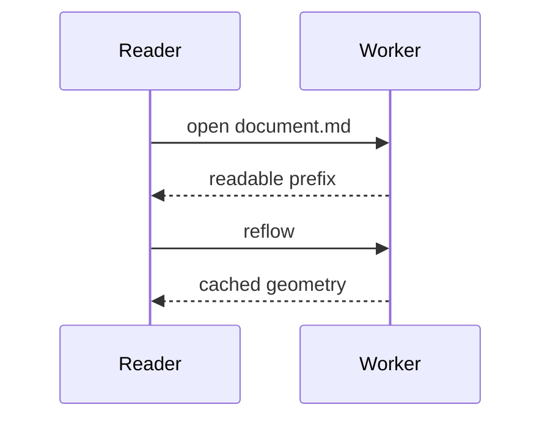

# Mermaid diagrams

A fenced block whose info string is `mermaid` is drawn as a diagram. The
diagram is measured and rasterised locally, so it works without a network and
appears in the window, in `--render` PNG output and in `--pdf`.



Extra words after the language are ignored, so this is still a diagram:



An unsupported or malformed diagram keeps its place as an error placeholder
instead of breaking the document:

```mermaid
flowchart LR
	subgraph Unclosed
	A --> B
```

Ordinary fences stay code, even when they mention Mermaid:

```rust
fn main() {
	println!("mermaid:");
}
```
