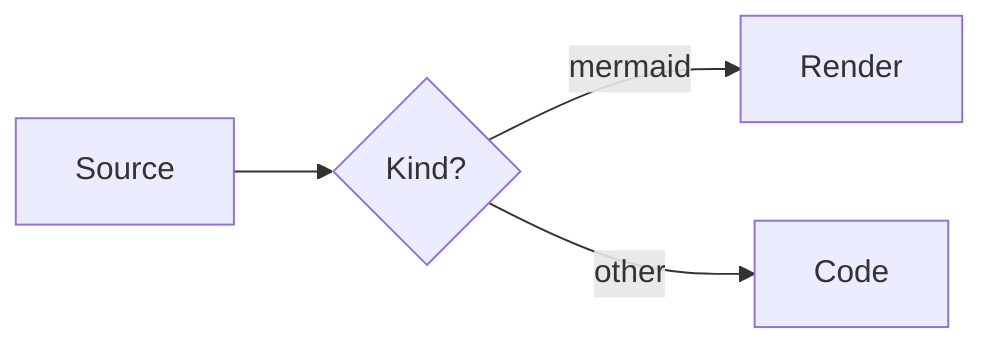
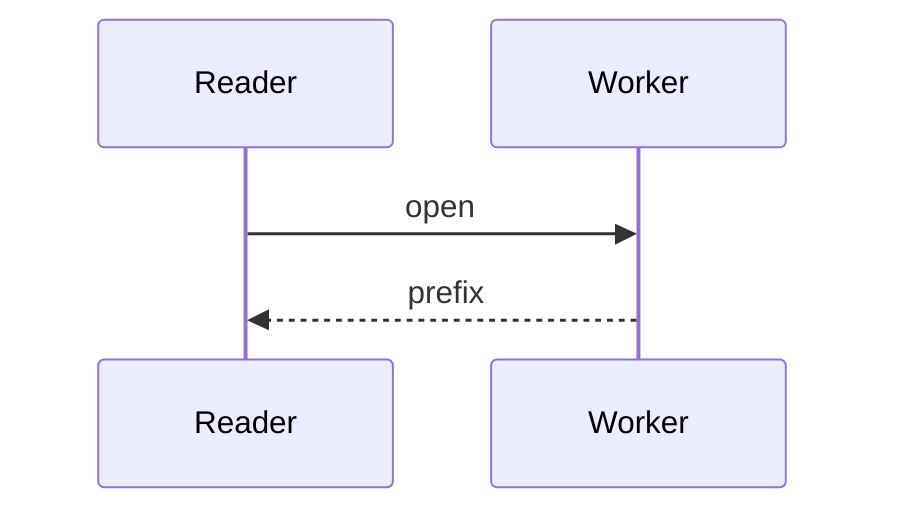
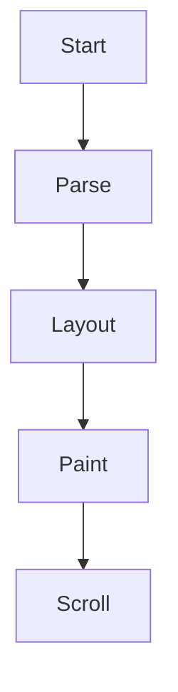

# Mermaid benchmark

Native diagram support keeps the reading column intact: a fenced block whose info string is mermaid becomes an image, measured on a worker and painted like any other picture. 排版与英文混排时，行宽与行距保持稳定。



Native diagram support keeps the reading column intact: a fenced block whose info string is mermaid becomes an image, measured on a worker and painted like any other picture. 排版与英文混排时，行宽与行距保持稳定。



Native diagram support keeps the reading column intact: a fenced block whose info string is mermaid becomes an image, measured on a worker and painted like any other picture. 排版与英文混排时，行宽与行距保持稳定。



Native diagram support keeps the reading column intact: a fenced block whose info string is mermaid becomes an image, measured on a worker and painted like any other picture. 排版与英文混排时，行宽与行距保持稳定。


Native diagram support keeps the reading column intact: a fenced block whose info string is mermaid becomes an image, measured on a worker and painted like any other picture. 排版与英文混排时，行宽与行距保持稳定。


Native diagram support keeps the reading column intact: a fenced block whose info string is mermaid becomes an image, measured on a worker and painted like any other picture. 排版与英文混排时，行宽与行距保持稳定。


Native diagram support keeps the reading column intact: a fenced block whose info string is mermaid becomes an image, measured on a worker and painted like any other picture. 排版与英文混排时，行宽与行距保持稳定。


Native diagram support keeps the reading column intact: a fenced block whose info string is mermaid becomes an image, measured on a worker and painted like any other picture. 排版与英文混排时，行宽与行距保持稳定。


Native diagram support keeps the reading column intact: a fenced block whose info string is mermaid becomes an image, measured on a worker and painted like any other picture. 排版与英文混排时，行宽与行距保持稳定。


Native diagram support keeps the reading column intact: a fenced block whose info string is mermaid becomes an image, measured on a worker and painted like any other picture. 排版与英文混排时，行宽与行距保持稳定。


Native diagram support keeps the reading column intact: a fenced block whose info string is mermaid becomes an image, measured on a worker and painted like any other picture. 排版与英文混排时，行宽与行距保持稳定。


Native diagram support keeps the reading column intact: a fenced block whose info string is mermaid becomes an image, measured on a worker and painted like any other picture. 排版与英文混排时，行宽与行距保持稳定。


Native diagram support keeps the reading column intact: a fenced block whose info string is mermaid becomes an image, measured on a worker and painted like any other picture. 排版与英文混排时，行宽与行距保持稳定。


Native diagram support keeps the reading column intact: a fenced block whose info string is mermaid becomes an image, measured on a worker and painted like any other picture. 排版与英文混排时，行宽与行距保持稳定。


Native diagram support keeps the reading column intact: a fenced block whose info string is mermaid becomes an image, measured on a worker and painted like any other picture. 排版与英文混排时，行宽与行距保持稳定。


Native diagram support keeps the reading column intact: a fenced block whose info string is mermaid becomes an image, measured on a worker and painted like any other picture. 排版与英文混排时，行宽与行距保持稳定。


Native diagram support keeps the reading column intact: a fenced block whose info string is mermaid becomes an image, measured on a worker and painted like any other picture. 排版与英文混排时，行宽与行距保持稳定。


Native diagram support keeps the reading column intact: a fenced block whose info string is mermaid becomes an image, measured on a worker and painted like any other picture. 排版与英文混排时，行宽与行距保持稳定。


Native diagram support keeps the reading column intact: a fenced block whose info string is mermaid becomes an image, measured on a worker and painted like any other picture. 排版与英文混排时，行宽与行距保持稳定。


Native diagram support keeps the reading column intact: a fenced block whose info string is mermaid becomes an image, measured on a worker and painted like any other picture. 排版与英文混排时，行宽与行距保持稳定。


Native diagram support keeps the reading column intact: a fenced block whose info string is mermaid becomes an image, measured on a worker and painted like any other picture. 排版与英文混排时，行宽与行距保持稳定。

```mermaid
flowchart TD
	Start --> Parse --> Layout --> Paint
	Paint --> Scroll
```

Native diagram support keeps the reading column intact: a fenced block whose info string is mermaid becomes an image, measured on a worker and painted like any other picture. 排版与英文混排时，行宽与行距保持稳定。

```mermaid
flowchart LR
	A[Source] --> B{Kind?}
	B -->|mermaid| C[Render]
	B -->|other| D[Code]
```

Native diagram support keeps the reading column intact: a fenced block whose info string is mermaid becomes an image, measured on a worker and painted like any other picture. 排版与英文混排时，行宽与行距保持稳定。

```mermaid
sequenceDiagram
	participant R as Reader
	participant W as Worker
	R->>W: open
	W-->>R: prefix
```

Native diagram support keeps the reading column intact: a fenced block whose info string is mermaid becomes an image, measured on a worker and painted like any other picture. 排版与英文混排时，行宽与行距保持稳定。

```mermaid
flowchart TD
	Start --> Parse --> Layout --> Paint
	Paint --> Scroll
```

Native diagram support keeps the reading column intact: a fenced block whose info string is mermaid becomes an image, measured on a worker and painted like any other picture. 排版与英文混排时，行宽与行距保持稳定。

```mermaid
flowchart LR
	A[Source] --> B{Kind?}
	B -->|mermaid| C[Render]
	B -->|other| D[Code]
```

Native diagram support keeps the reading column intact: a fenced block whose info string is mermaid becomes an image, measured on a worker and painted like any other picture. 排版与英文混排时，行宽与行距保持稳定。

```mermaid
sequenceDiagram
	participant R as Reader
	participant W as Worker
	R->>W: open
	W-->>R: prefix
```

Native diagram support keeps the reading column intact: a fenced block whose info string is mermaid becomes an image, measured on a worker and painted like any other picture. 排版与英文混排时，行宽与行距保持稳定。

```mermaid
flowchart TD
	Start --> Parse --> Layout --> Paint
	Paint --> Scroll
```

Native diagram support keeps the reading column intact: a fenced block whose info string is mermaid becomes an image, measured on a worker and painted like any other picture. 排版与英文混排时，行宽与行距保持稳定。

```mermaid
flowchart LR
	A[Source] --> B{Kind?}
	B -->|mermaid| C[Render]
	B -->|other| D[Code]
```

Native diagram support keeps the reading column intact: a fenced block whose info string is mermaid becomes an image, measured on a worker and painted like any other picture. 排版与英文混排时，行宽与行距保持稳定。

```mermaid
sequenceDiagram
	participant R as Reader
	participant W as Worker
	R->>W: open
	W-->>R: prefix
```

Native diagram support keeps the reading column intact: a fenced block whose info string is mermaid becomes an image, measured on a worker and painted like any other picture. 排版与英文混排时，行宽与行距保持稳定。

```mermaid
flowchart TD
	Start --> Parse --> Layout --> Paint
	Paint --> Scroll
```

Native diagram support keeps the reading column intact: a fenced block whose info string is mermaid becomes an image, measured on a worker and painted like any other picture.


